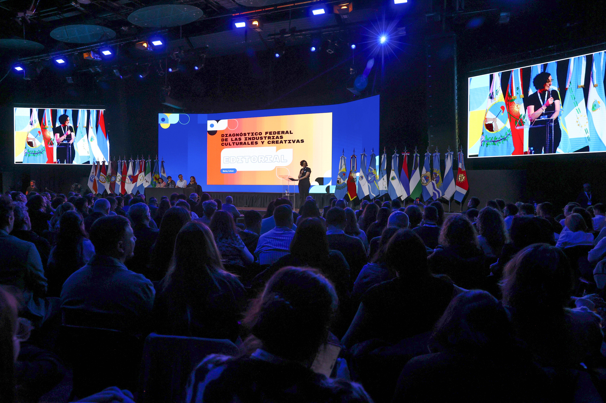
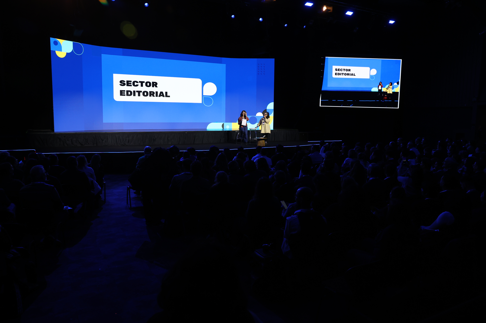
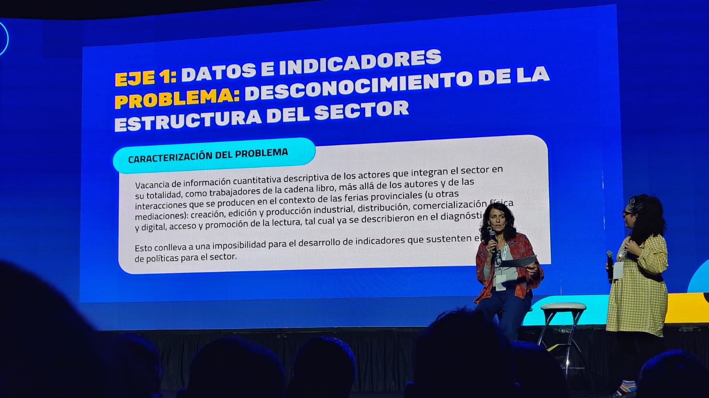

En junio participé del Encuentro Federal de Industrias Culturales y Creativas (EFICC), realizado en Mendoza y organizado por el Consejo Federal de Inversiones (CFI). Sin embargo, la experiencia que se vio durante esos tres días fue apenas la parte visible de un trabajo mucho más extenso.

Durante los meses previos coordiné la elaboración del diagnóstico federal de la industria editorial, un proceso que reunió a representantes de las distintas jurisdicciones del país para construir una mirada compartida sobre los principales desafíos del sector. El objetivo no era únicamente describir problemas, sino generar una base de evidencia que permitiera orientar futuras estrategias de desarrollo y fortalecer el diseño de políticas públicas.

A través de encuentros de trabajo, intercambios con equipos provinciales y sistematización de información sectorial, construimos un diagnóstico organizado en seis dimensiones: producción y circulación, datos e indicadores, normativa y gobernanza, financiamiento, internacionalización y formación. El proceso permitió identificar problemáticas recurrentes en distintas regiones del país, pero también reconocer experiencias, capacidades y oportunidades que muchas veces permanecen invisibilizadas en las discusiones nacionales.

Entre los principales hallazgos apareció la fuerte concentración territorial de la actividad editorial, la baja escala de producción en gran parte de las provincias, las dificultades de circulación y logística, el crecimiento de la autoedición y la fragmentación de la información disponible sobre el sector. También se identificó una vacancia significativa en materia de datos e indicadores, que limita la posibilidad de comprender integralmente la cadena del libro y desarrollar políticas basadas en evidencia.
La presentación realizada en Mendoza constituyó un momento clave de ese proceso. Los resultados fueron expuestos ante los equipos de cultura de todas las provincias y posteriormente discutidos colectivamente por representantes sectoriales y funcionarios provinciales. A partir de ese intercambio se priorizaron los problemas considerados más urgentes para el desarrollo de la industria editorial.

El resultado fue significativo. Entre todas las dimensiones analizadas, las provincias identificaron como prioridades estratégicas la producción y circulación del libro y la necesidad de fortalecer los sistemas de datos e indicadores para el sector. Como propuesta de trabajo, se planteó avanzar hacia un mapeo federal de la cadena de valor editorial, articulando información pública y privada, universidades, cámaras empresariales y organizaciones del sector, con el objetivo de desarrollar herramientas abiertas que permitan mejorar el conocimiento y la gestión de la actividad editorial en todo el país.
Desde el Núcleo de Innovación Social seguimos con interés este tipo de experiencias porque muestran el valor que tiene la producción colaborativa de conocimiento para abordar problemas complejos. La construcción de diagnósticos federales no es solamente un ejercicio técnico: es una forma de generar acuerdos, visibilizar realidades diversas y construir capacidades colectivas para la toma de decisiones.

En un contexto donde la disponibilidad de información suele ser una de las principales limitaciones para el diseño de políticas públicas, la experiencia del sector editorial dejó una enseñanza clara: antes de pensar soluciones, es necesario construir una comprensión compartida de los problemas. Y esa construcción requiere tiempo, articulación y trabajo colectivo.

```{=html}

<div id="carouselEFICC" class="carousel slide">

  <div class="carousel-inner">

    <div class="carousel-item active">
      
    </div>

    <div class="carousel-item">
      
    </div>

    <div class="carousel-item">
      
    </div>
    
     <div class="carousel-item">
      
    </div>
    
     <div class="carousel-item">
      
    </div>
    
     <div class="carousel-item">
      
    </div>


  </div>

  <button class="carousel-control-prev" type="button"
          data-bs-target="#carouselEFICC"
          data-bs-slide="prev">
    <span class="carousel-control-prev-icon"></span>
  </button>

  <button class="carousel-control-next" type="button"
          data-bs-target="#carouselEFICC"
          data-bs-slide="next">
    <span class="carousel-control-next-icon"></span>
  </button>

</div>
```
