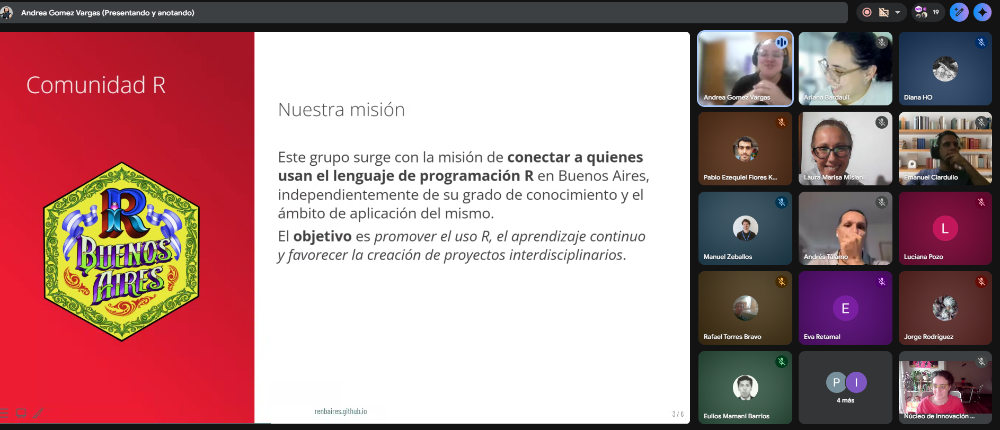

El pasado jueves 19 de marzo realizamos un nuevo encuentro de la comunidad de datos, organizado en conjunto entre Núcleo de Innovación Social y R Buenos Aires.

En esta oportunidad, Ariana Bardauil presentó Positron, la nueva IDE desarrollada por Posit para trabajar con R y Python, y mostró cómo utilizarla para crear y mejorar el CV técnico.

La actividad reunió a más de 40 personas interesadas en fortalecer su perfil profesional en el campo del análisis de datos. A lo largo del encuentro, no solo se exploraron las funcionalidades de la herramienta, sino que también se abrió una conversación clave: cómo comunicar de manera efectiva nuestras habilidades y en un mercado laboral cada vez más competitivo.

Este tipo de espacios busca no solo acercar nuevas herramientas, sino también acompañar procesos concretos de desarrollo profesional dentro de la comunidad.

📺 El video completo del meetup ya se encuentra disponible en [YouTube](https://www.youtube.com/watch?v=_isXABo4_N8)

Agradecemos a todas las personas que participaron y seguimos construyendo espacios de aprendizaje colectivo.

Próximamente estaremos anunciando nuevas actividades.
