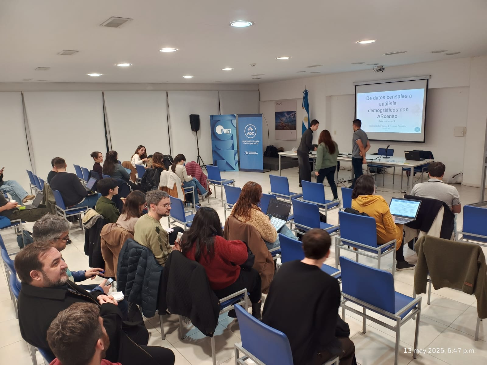
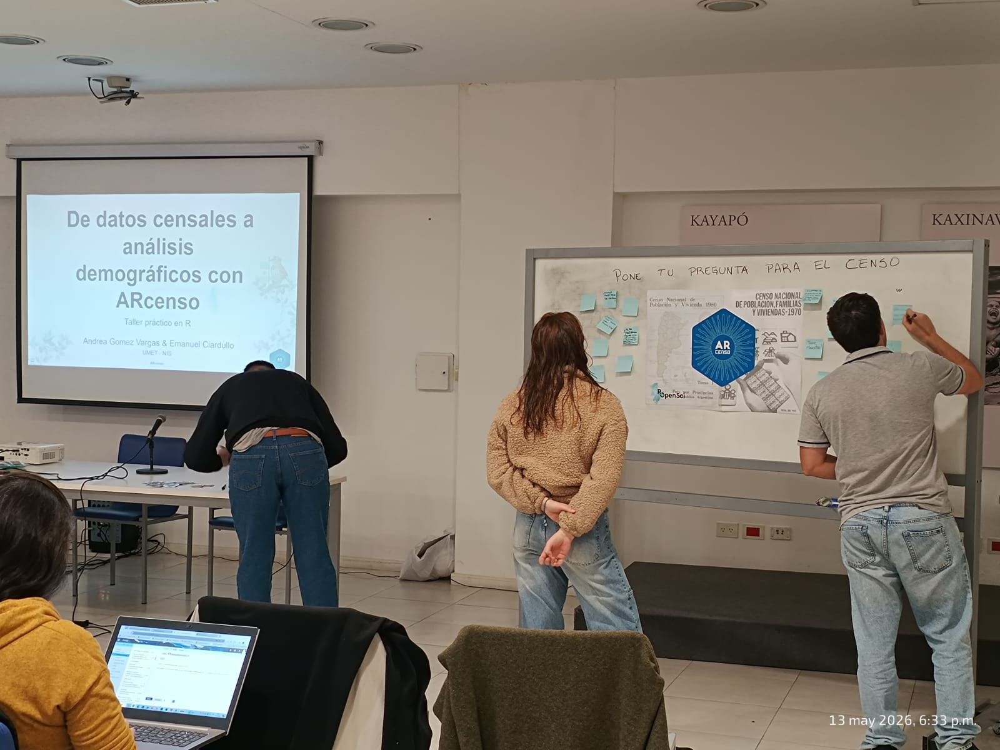
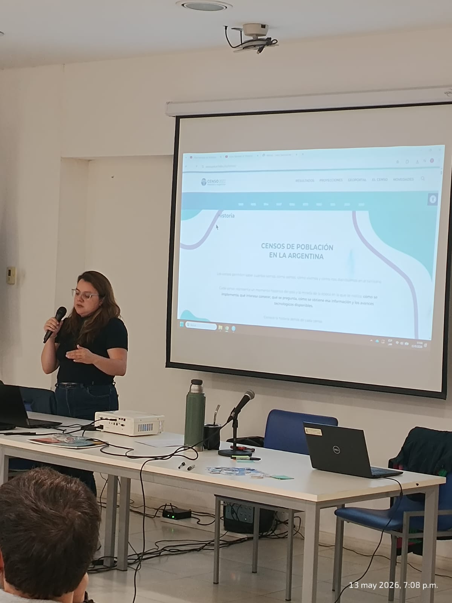
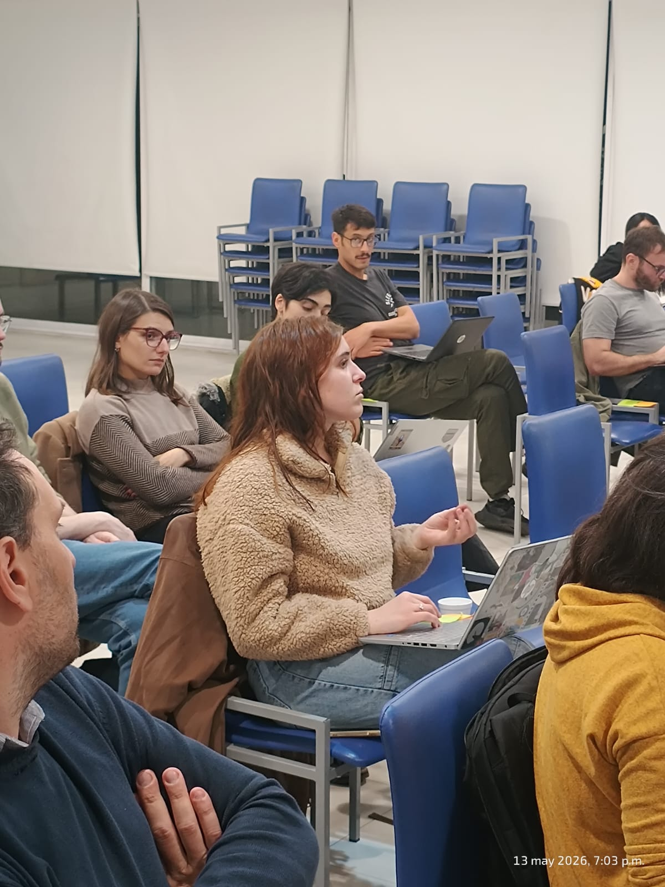

El miércoles 13 de mayo se realizó en UMET el taller “De datos censales a análisis demográficos con {ARcenso}: taller práctico en R”, organizado por NIS, UMET y AGC TI.

La actividad estuvo a cargo de Andrea Gomez Vargas, licenciada en Sociología y desarrolladora del paquete {ARcenso}, y Emanuel Ciardullo, licenciado en Estadística y co-desarrollador de la herramienta. Durante el encuentro presentaron distintas formas de acceder y trabajar con datos censales en R de manera más eficiente y reproducible.

A partir de ejemplos prácticos, se mostró cómo {ARcenso} permite simplificar procesos habituales en el análisis de datos del Censo, evitando descargas complejas y tareas manuales de limpieza y organización de información.

El taller contó con más de 70 personas inscriptas y generó un espacio de intercambio entre personas interesadas en análisis de datos, estadísticas públicas y herramientas open source aplicadas a investigación y gestión.

Gracias a quienes se acercaron, hicieron preguntas y compartieron el espacio. Y gracias especialmente a Andrea y Emanuel por abrir el detrás de escena del paquete y mostrar que la infraestructura de datos también puede ser una herramienta de democratización.

