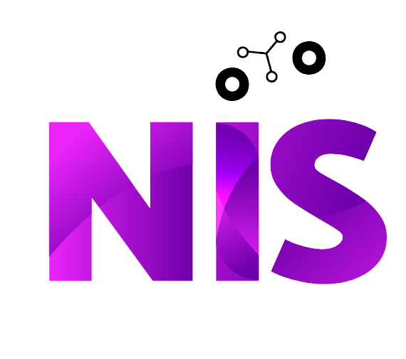

# **¡Bienvenidos al Núcleo de Innovación Social!**

::::: columns
::: {.column width="60%"}
Somos un `laboratorio` de trabajo con un enfoque multidisciplinario, arraigado en las `ciencias sociales.`

Creamos `iniciativas` de investigación, desarrollo y formación generando `insights accionables` basados en evidencia.

Nuestra misión es promover procesos de `transformación` y mejora colectiva basados en el conocimiento, la `innovación` y la sostenibilidad.
:::

::: {.column width="40%"}
{fig-align="center" width="230"}
:::
:::::

#  ¿Qué hacemos? 

::::::::::: grid
::: {.g-col-6 .card4}
#### 🎤 Workshops y capacitaciones
:::

::: {.g-col-6 .card4}
#### 🧼 Limpieza y normalización de datos
:::

::: {.g-col-6 .card4}
#### 📊 Modelado estadístico
:::

::: {.g-col-6 .card4}
#### 📖 Data storytelling interactivo
:::

::: {.g-col-6 .card4}
#### 📈 Indicadores de gestión y producción
:::

::: {.g-col-6 .card4}
#### 🏗️ Gestión de datos e información
:::

::: {.g-col-6 .card4}
#### 📝 Encuestas online
:::

::: {.g-col-6 .card4}
#### 📄 Informes ad-hoc
:::
:::::::::::

<br>

:::: {style="background-color: #9d0fc8; color: white; padding: 40px 20px; text-align: center; border-radius: 12px; margin-bottom: 30px;"}
<h3 style="color: white; margin-bottom: 10px;">

Accedé a nuestros cursos y capacitaciones

</h2>

<p>Potenciá tus habilidades con nuestras formaciones en ciencias sociales computacionales</p>

<a href="cursos.html" class="btn" style="background-color: white; color: #9d0fc8; font-weight: 600; padding: 10px 20px; border-radius: 8px; display: inline-block; margin-top: 15px;">Ver cursos y capacitaciones</a>

</div>

# Novedades

</a>

::: {#last_contenido}
:::

```{=html}
<script>(function(t,e,s,o){var n,a,c;t.SMCX=t.SMCX||[],e.getElementById(o)||(n=e.getElementsByTagName(s),a=n[n.length-1],c=e.createElement(s),c.type="text/javascript",c.async=!0,c.id=o,c.src="https://widget.surveymonkey.com/collect/website/js/tRaiETqnLgj758hTBazgdzxwuSQVZA5gS55pIr4pOSb5YLSS_2BiHbKJ3kHcpQYeLx.js",a.parentNode.insertBefore(c,a))})(window,document,"script","smcx-sdk");</script>
```
::::
