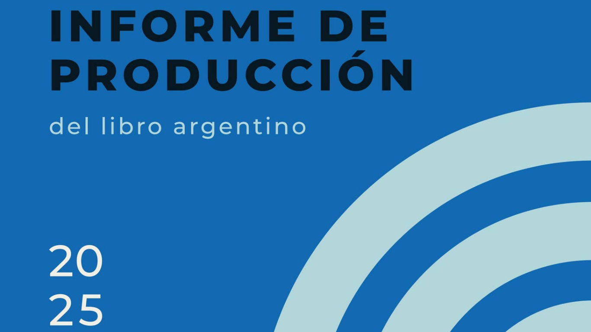

La Cámara Argentina del Libro publicó el Informe de Producción del Libro Argentino 2025, elaborado en colaboración con el Núcleo de Innovación Social (NIS), a partir de los registros de la Agencia Argentina de ISBN.

Los datos muestran una dinámica que, lejos de ser contradictoria, describe con bastante precisión el momento actual del sector editorial: se publican más libros, pero en tiradas cada vez más pequeñas.
En 2025 se registraron 36.942 publicaciones, un crecimiento interanual del 17% y el valor más alto de la serie reciente. Sin embargo, la tirada total cayó un 34%, alcanzando los 34,6 millones de ejemplares. Esta caída no responde a una menor actividad editorial, sino al retiro de las grandes compras estatales: la edición pública y las compras institucionales pasaron de representar el 29% de la tirada en 2024 a apenas el 5% en 2025.

El formato papel sigue siendo dominante (75% de los registros), mientras que lo digital se mantiene estable y el audiolibro continúa subregistrado.

En el Sector Editorial Comercial (SEC), se observa una tendencia clara hacia la fragmentación:
Más títulos publicados, pero tiradas iniciales más bajas (el 26% no supera los 600 ejemplares).
Este fenómeno convive con una mayor concentración en términos de ejemplares: las editoriales grandes mantienen ventaja en volumen, mientras que las PYMES lideran en cantidad de títulos (74%).

Por fuera del circuito tradicional, dos procesos ganan protagonismo:
La autoedición, que alcanzó un récord histórico de 6.078 publicaciones y crece sostenidamente desde 2016.
Las empresas de servicios editoriales, que consolidan un modelo basado en la financiación directa por parte de autores.

En conjunto, los datos configuran un ecosistema editorial más diverso, con barreras de entrada más bajas pero mayores desafíos de visibilidad y sostenibilidad.

El informe, desarrollado con herramientas de código abierto y criterios de transparencia metodológica, busca aportar evidencia para comprender un sector en transformación, donde la expansión de la producción no necesariamente implica mayor circulación ni acceso.

Accedé al informe completo [aquí](https://issuu.com/camaradellibro/docs/informe_de_producci_n-_libro_argentino_2025_)
