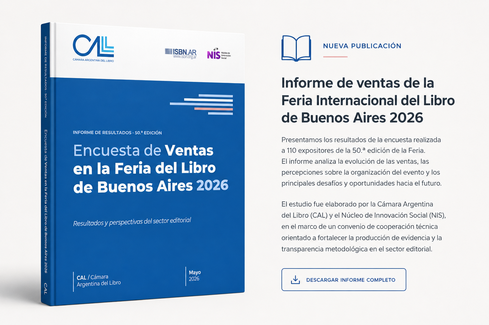

El Núcleo de Innovación Social (NIS) participó en la elaboración del informe de ventas de la 50.ª edición de la Feria Internacional del Libro de Buenos Aires, desarrollado en conjunto con la Cámara Argentina del Libro (CAL). El estudio se basa en una encuesta realizada a 110 expositores y analiza la evolución de las ventas, las percepciones sobre la organización del evento y los principales desafíos y oportunidades identificados por quienes participaron de esta edición. Desde el NIS acompañamos el diseño metodológico, el procesamiento y análisis de los datos, así como la elaboración del informe final. Este trabajo contó con la coordinación de **Ariana Bardauil**, en colaboración con **Candela Fia** y **Gonzalo Fiordelisi**, en el marco del convenio de cooperación técnica entre la CAL y el NIS orientado a fortalecer la producción de evidencia, la transparencia metodológica y la generación de conocimiento para la toma de decisiones en el sector editorial. La experiencia refleja una de las líneas de trabajo que impulsamos desde el NIS: acompañar a organizaciones e instituciones en el diseño de relevamientos, el análisis de información y la producción de conocimiento aplicado para comprender mejor sus desafíos y orientar sus estrategias.

Agradecemos a la Cámara Argentina del Libro por la confianza y a todas las editoriales y expositores que participaron del estudio.

