El Núcleo de Innovación Social se suma como parte del equipo interdisciplinario que acompaña el proceso de puesta en valor de la Biblioteca Pública Municipal «Manuel José Olascoaga» de Chos Malal, en el marco de las acciones impulsadas por la Secretaría de Cultura de la Provincia del Neuquén y el Fondo Editorial Neuquino (FEN).

La reciente inauguración de la segunda etapa de refuncionalización del edificio de la biblioteca constituye un nuevo hito dentro de un proceso más amplio de fortalecimiento institucional, preservación patrimonial y modernización de herramientas para la gestión del acervo bibliográfico.

Como parte de este trabajo, el NIS asiste al FEN impulsando el diseño de una estrategia de relevamiento participativo del fondo bibliográfico histórico, que combinará preservación del patrimonio, documentación sistemática y alfabetización de datos.

La propuesta contempla el desarrollo de una sistema digital de relevamiento de código abierto que permitirá registrar información bibliográfica, documentar el estado de conservación de los ejemplares y almacenar evidencia fotográfica que sirva como insumo para futuras acciones de conservación, restauración y puesta en valor del patrimonio documental.

Además del desarrollo tecnológico, la iniciativa busca involucrar a la comunidad local en la producción de información de calidad sobre su propio patrimonio cultural. De este modo, el relevamiento se convierte también en una experiencia de aprendizaje sobre registro documental, calidad de datos, herramientas digitales y análisis de información.

Creemos que la innovación social también consiste en construir tecnologías que fortalezcan el acceso al patrimonio, promuevan la participación ciudadana y generen capacidades locales para cuidar la memoria colectiva.

```{=html}
<div id="carouselchosmalal" class="carousel slide">

  <div class="carousel-inner">

    <div class="carousel-item active">
      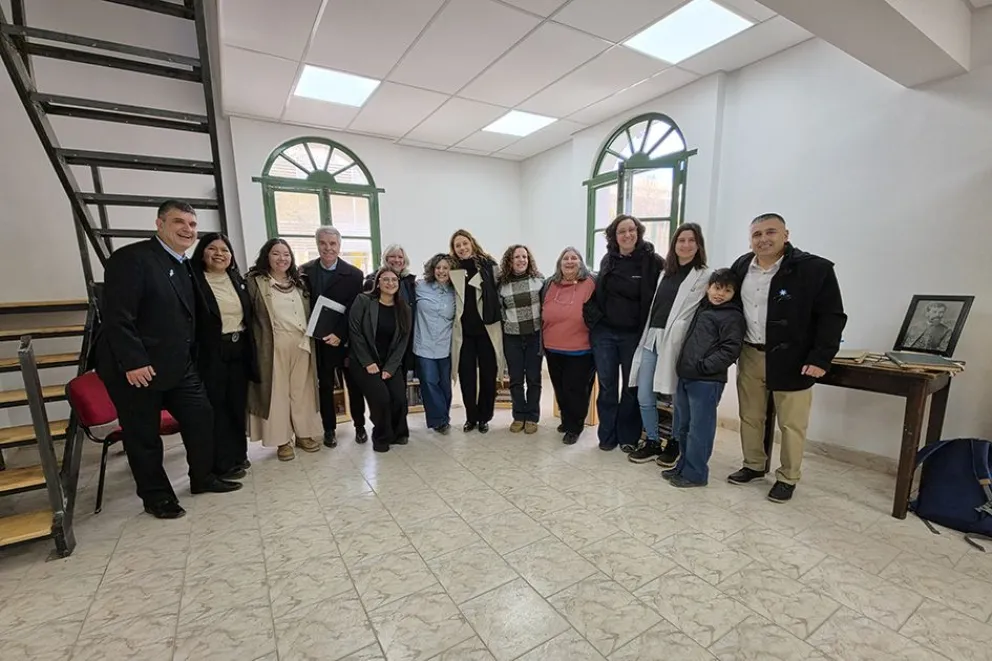
    </div>

    <div class="carousel-item">
      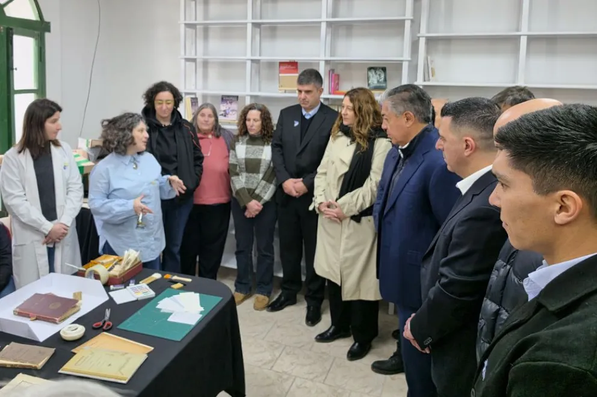
    </div>

    <div class="carousel-item">
      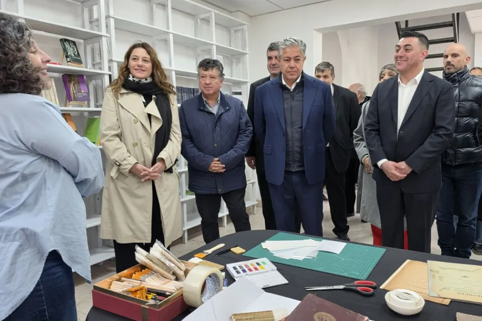
    </div>

    <div class="carousel-item">
      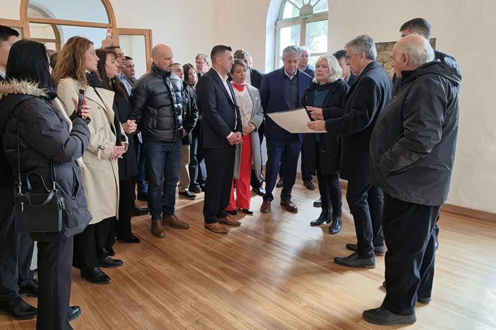
    </div>

    <div class="carousel-item">
      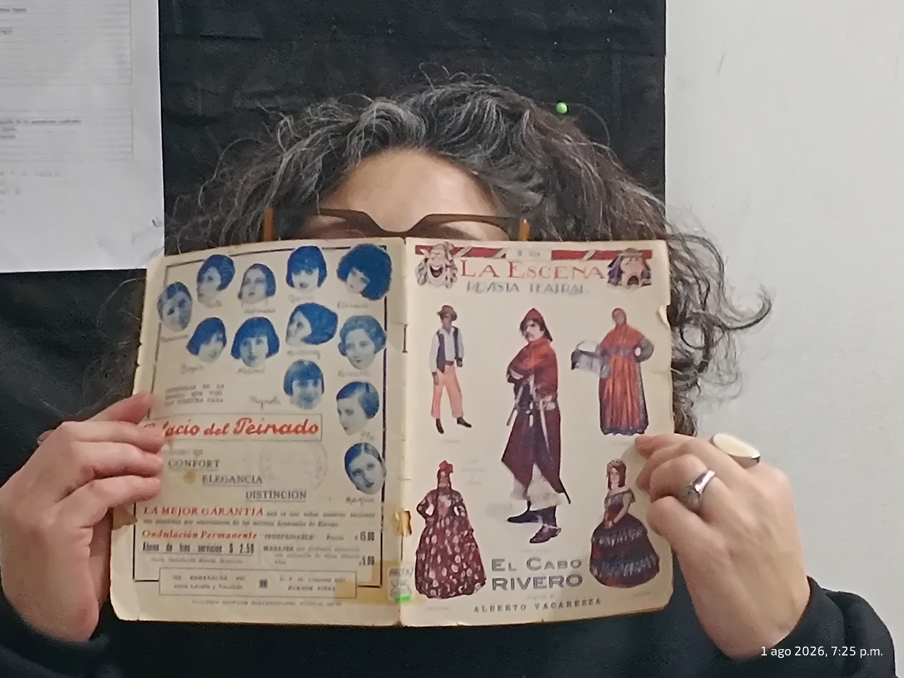
    </div>

    <div class="carousel-item">
      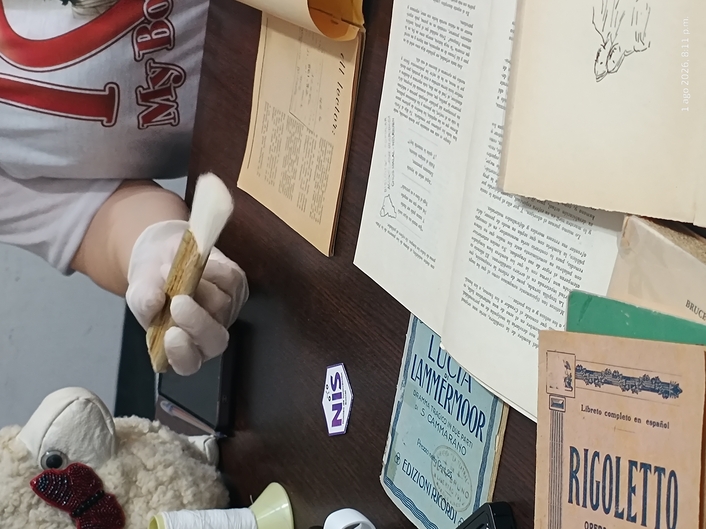
    </div>

    <div class="carousel-item">
      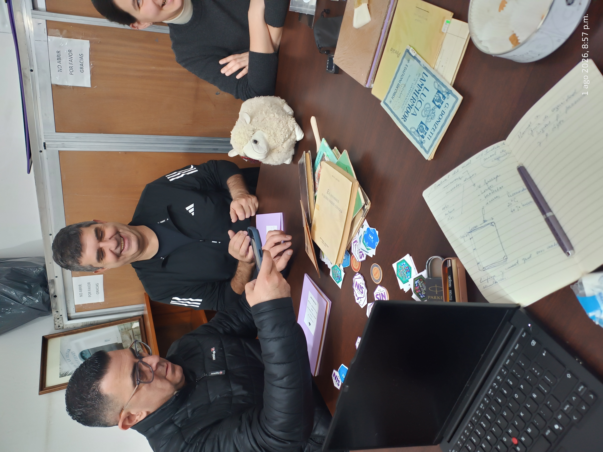
    </div>

    <div class="carousel-item">
      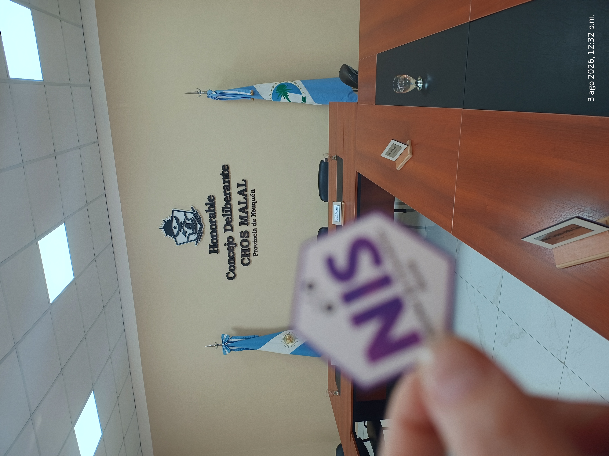
    </div>

    <div class="carousel-item">
      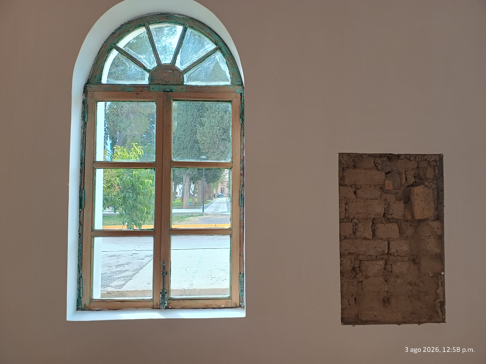
    </div>

    <div class="carousel-item">
      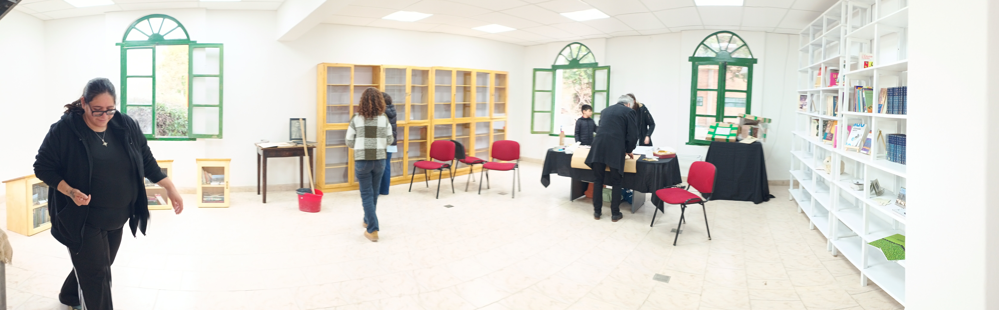
    </div>

    <div class="carousel-item">
      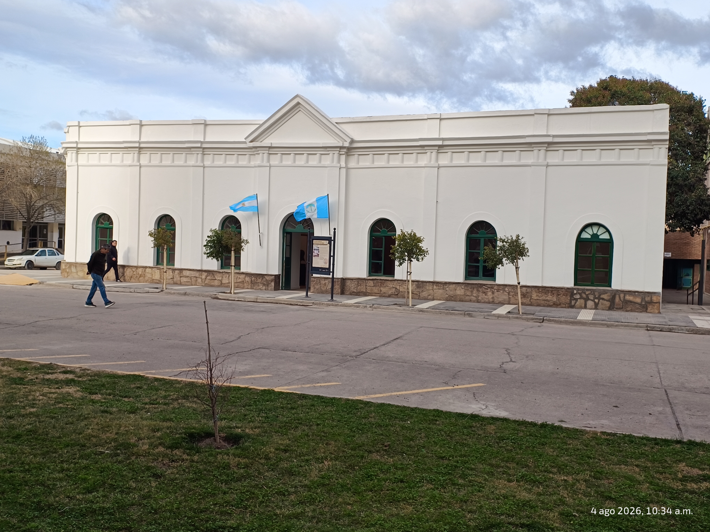
    </div>

    <div class="carousel-item">
      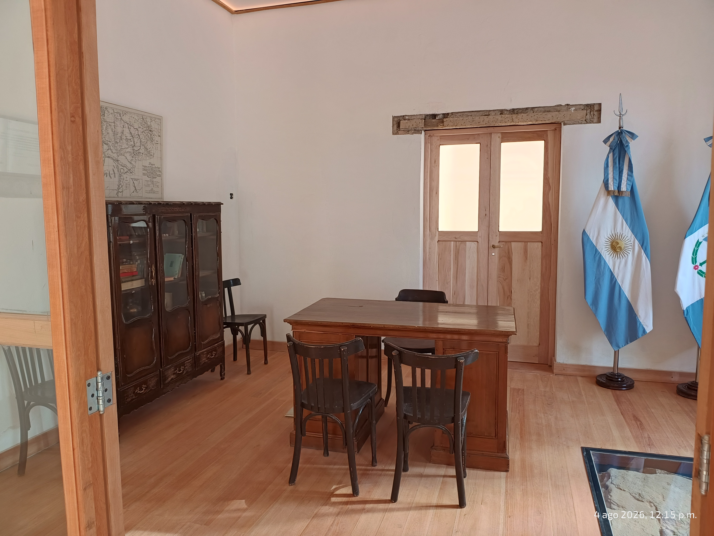
    </div>

    <div class="carousel-item">
      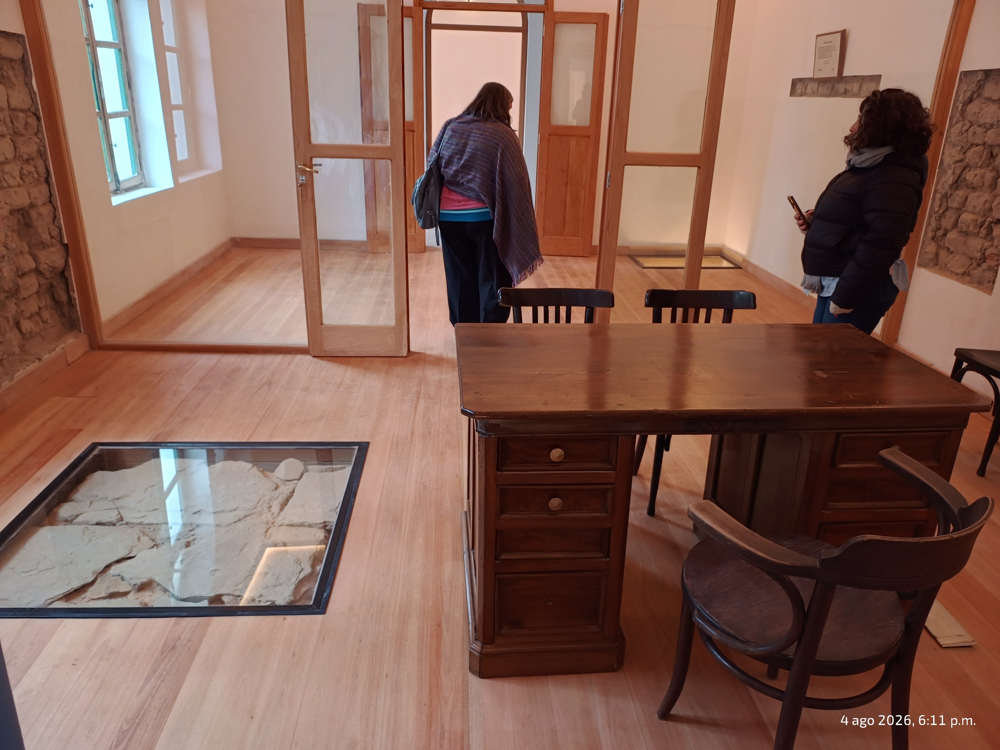
    </div>

  </div>

  <button class="carousel-control-prev" type="button"
          data-bs-target="#carouselchosmalal"
          data-bs-slide="prev">
    <span class="carousel-control-prev-icon"></span>
  </button>

  <button class="carousel-control-next" type="button"
          data-bs-target="#carouselchosmalal"
          data-bs-slide="next">
    <span class="carousel-control-next-icon"></span>
  </button>

</div>
```
